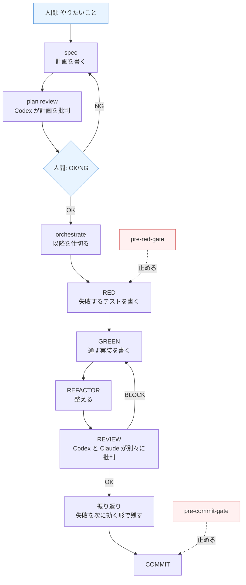

# dev-crew の全体図

最終更新: 2026-09-16

**この文書の役割**: dev-crew に何があって、どう繋がっているかを 1 枚で把握する。ブラウザで読む前提（`mdopen docs/OVERVIEW.md`）。

- 詳細な設計 → [architecture.md](architecture.md)
- 開発の手順 → [workflow.md](workflow.md)
- 原則と判断基準 → [../CONSTITUTION.md](../CONSTITUTION.md)
- **全体像 → この文書**

---

## 1 行で言うと

**人間が「やりたいこと」と「OK/NG」だけ出せば、設計からコミットまで AI が回す仕組み。**

## 流れ



青が**人間が判断する場所**、赤が**機械が強制的に止める場所**。それ以外は AI が回す。

## 部品

| 置き場 | 何か | 触るとき |
|---|---|---|
| `skills/` | AI への手順書。`/spec` `/orchestrate` などで呼ぶ | 手順を変えたいとき |
| `agents/` | 役割ごとの AI。実装者・レビュアー・攻撃役など | 誰にやらせるかを変えたいとき |
| `scripts/gates/` | **止める仕組み**。条件を満たさないと先へ進めない | 「AI が手順を飛ばす」を防ぎたいとき |
| `scripts/hooks/` | Claude Code に割り込む仕組み。危険コマンドの阻止など | 事故を機械的に防ぎたいとき |
| `rules/` | 過去の失敗から作った禁止事項・推奨事項 | 同じ失敗を繰り返したとき |
| `tests/` | 上記すべてが壊れていないことの検査 | 何か変えたら必ず |
| `run-tests.sh` | テストを走らせる入口 | テストを走らせるとき |
| `docs/cycles/` | 1 回の開発の記録（**AI 向けの詳細記録**） | 「なぜこうなったか」を掘るとき |

### なぜ gates と rules が分かれているか

`rules/` は**文章**なので、AI が読んでも守るとは限らない。実際に守らせたいことは `scripts/gates/` に**コード**として書く。CONSTITUTION 原則 6 の「LLM に手順を守れと指示するのではなく、ゲートが止める」がこれ。

**文章で 2 回防げなかったことは、コードに昇格させる**（2-strike rule）。

## テストの走らせ方

```bash
bash run-tests.sh                              # 全部
bash run-tests.sh tests/test-plugin-structure.sh  # 1 本だけ
```

走る前に、マシンの負荷とメモリを見て、余裕がなければ止まる。実行はリポジトリのコピーの上で行うので、走っている最中にファイルを触っても結果は汚れない。

終了コードの意味:

| コード | 意味 |
|---|---|
| 0 | 全部通った |
| 1 | テストが落ちた |
| 2 | マシンが忙しいので走らせなかった |
| 3 | 引数がおかしい |
| 4 | コピー中にファイルが動き続けた |
| 5 | コピーや計測そのものが失敗した |

## 最近変えたところ

| いつ | どこ | 何を |
|---|---|---|
| 2026-09-13 | `run-tests.sh` | テスト実行前の負荷チェックと、コピー上での実行を追加。[cycle doc](cycles/20260913_0059_runner-admission-snapshot.md) |

**未解決の課題**: この変更で `run-tests.sh` は元の数十行規模から大きく膨らんだ（現在の規模は `wc -l run-tests.sh` で確認する）。やっていることは上の 5 行で説明できるが、実装には PID 追跡・所有者情報・再試行・三点照合といった、道具の役割を超えた機構が入っている。**縮小を検討中。**
